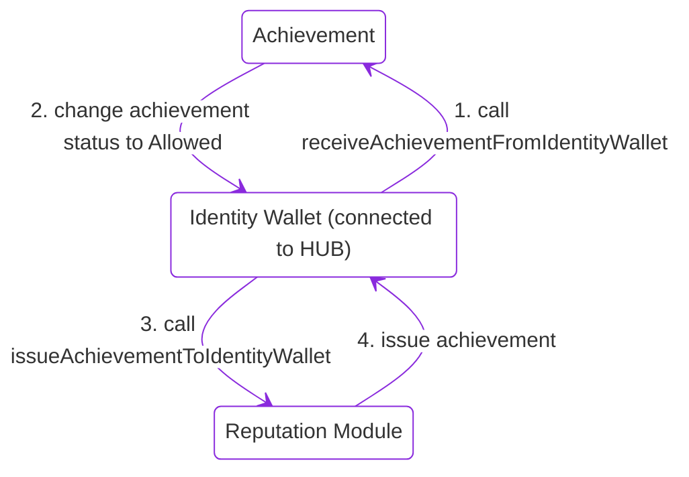

# User Public Achievements Standard


---

## Generate candid for canisters

```bash
sh generate_candid.sh
```

---

## Deploy

**deploy public-achievement canisters**

```bash
dfx start --clean --background
dfx deploy 
```

**deploy icrc-7 achievement collection**

[yuku_icrc7](https://github.com/tuminfei/yuku_icrc7)
Pass reputation_module to minter (owner)

```bash
dfx deploy icrc7 --argument '(record{                                  
minting_account= opt record {
    owner = principal "$(dfx canister id reputation_module)";                                     
    subaccount = opt blob "\00\00\00\00\00\00\00\00\00\00\00\00\00\00\00\00\00\00\00\00\00\00\00\00\00\00\00\00\00\00\00\00";
  };                  
icrc7_supply_cap= null;
icrc7_description= opt "Achievements issued by {your issuer name}";
tx_window= null;                        
permitted_drift= null;                  
icrc7_max_take_value= null;
icrc7_max_memo_size= null;
icrc7_symbol= "PAC";
icrc7_max_update_batch_size= null;
icrc7_max_query_batch_size= null;
icrc7_atomic_batch_transfers= null;
icrc7_default_take_value= null;
icrc7_logo= null;
icrc7_name= "Public Achievements"
})'
```

**Add metadata to reputation_module**

```bash
dfx canister call reputation_module updateReputationModuleMetadata "record {achievement_collection=principal \"$(dfx canister id icrc7)\"; issuer_name=\"test\"; issuer_description=\"test\"; total_issued=0}"
```

**Add metadata to deployed achievement**

```bash
dfx canister call achievement updateAchivementMetadata '(record {achievement_name="Test achievement"; achievement_description="Description of test achievement"})'
```

**Add deployed achievement to reputation_module**

```bash
dfx canister call reputation_module changePermissionCanister "(principal \"$(dfx canister id achievement)\", true)"
```

---

## Achievement flow 

### init identities

```bash
dfx identity new pa_local_wallet
dfx identity new pa_identity_wallet
dfx identity list
```

---

### Scenario 1. Get achievement from local_wallet to identity_wallet

```mermaid


stateDiagram-v2
    [*] --> A1
    state A1 as "Local Principal\n(connected to dapp)"
    state B1 as "Achievement"
    state C1 as "Identity Wallet\n(connected to HUB)"
    state D1 as "Reputation Module"
    
    A1 --> B1 : Call method\n"generateHashToIdentityWallet"
    B1 --> C1 : Generate hash\nto identity Wallet
    C1 --> B1 : Call receive\n"AchievementFromIdentityWalletWithHash"
    B1 --> C1 : Change achievement\nstatus to "Allowed"
    C1 --> D1 : Call issue\n"AchievementToIdentityWallet"
    D1 --> C1 : Issue achievement


```

**Generate hash to identity wallet**

Call the generateHashToIdentityWallet method in the Achievement canister from the local wallet and pass the identity wallet to which the achievement will be transferred in the arguments.

```bash
dfx --identity pa_local_wallet canister call achievement generateHashToIdentityWallet "(principal \"$(dfx --identity pa_identity_wallet identity get-principal)\", vec {})"

(
  variant {
    Ok = "Succesfully generate hash for Identity Wallet. Signature 5ac9cae0bd534ee09eea7bf9ddd85a53ba13efe9a416fb13155b46fa2af2f3f0671b2b79c534a29ade73811098cb947ccbd606b935aa1e0610093eac3b3ddc00"
  },
)
```

**Get allowed status from identity wallet with hash**

Call receiveAchievementFromIdentityWalletWithHash method in the Achievement canister from the identity wallet. Use the address of the local wallet, which performed this action, as an argument. The function checks the hash match and if everything is fine, it changes the status of the identity wallet's achievement to **'allowed'**.

```bash
dfx --identity pa_identity_wallet canister call achievement receiveAchievementFromIdentityWalletWithHash "(principal \"$(dfx --identity pa_local_wallet identity get-principal)\")"

(variant { Ok = "Achievement status changed to allowed" })
```

**Receiving an achievement from identity wallet**

Call issueAchievementToIdentityWallet method in the ReputationModule canister with the identity wallet (if the interface is present, this function is called from the hub). As an argument, we pass the address of the Achievement canister and if the function confirms that within the Achievement canister the status of the identity wallet is **'allowed'**, it issues an achievement in the format supported by the ReputationModule.

```bash
dfx --identity pa_identity_wallet canister call reputation_module issueAchievementToIdentityWallet "(principal \"$(dfx canister id achievement)\")"

(variant { Ok = "Achievement issued" })
```

---

### Scenario 2. Receive achievement directly from identity_wallet



Suitable for people who do not use Internet Identity but use wallets such as Plug and use one address in all applications.

**Get allowed status from identity wallet**

Call the receiveAchievementFromIdentityWallet method, if the identity wallet meets the conditions for receiving an achievement, then the achievement status changes to **'allowed'**.

```bash
dfx --identity pa_identity_wallet canister call achievement receiveAchievementFromIdentityWallet "(vec {})"

(variant { Ok = "Achievement status changed to allowed" })
```

**Receiving an achievement from identity wallet**

Call issueAchievementToIdentityWallet method in the ReputationModule canister with the identity wallet (if there is an interface, this function is called from the hub). As an argument, we pass the address of the Achievement canister, and if the function confirms that the status of the identity wallet inside the Achievement canister is **'allowed'**, it issues an achievement in the format supported by ReputationModule.

```bash
dfx --identity pa_identity_wallet canister call reputation_module issueAchievementToIdentityWallet "(principal \"$(dfx canister id achievement)\")"

(variant { Ok = "Achievement issued" })
```

---

### Additional information 

**Method** `checkAchievementEligibility`

Blob - accepts additional parameters encoded in bytes, for example, an additional Metamask signature. If the function does not use this argument, an empty byte array is passed.

